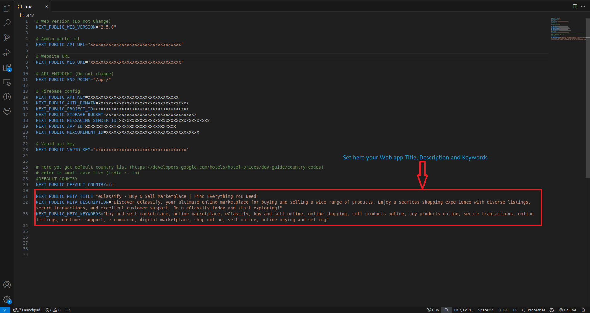

# How to Change Web Application Name

Change application name for your Web application. Go to `.env file`

You can modify the application name by changing the appropriate environment variable in your .env file as shown in the screenshot above.
